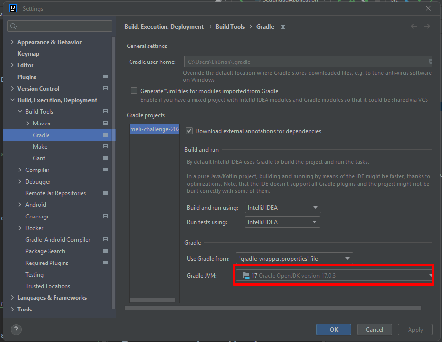

# meli-challenge-2024
## Aplicación de Seguridad

Aplicación que contiene el consumo de la información de clientes de una empresa. Se implementaron Autorización y autenticación para mantener segura nuestra aplicación, además de buenas prácticas de programación y seguridad de la información.

# Ejecución
## Prerequisitos para ejecución en local sin IDE

- Instalar Docker y docker-compose e iniciarlo
- Tener instalado Java 17
- Tener instalado Gradle 8.7
- Tener instalado postman

## Prerequisitos para ejecución en local con IDE IntellIj

- Instalar Docker y docker-compose e iniciarlo
- Configurar IDE con Java 17 y Gradle 8.7

## Pasos para ejecución de ambiente local sin IDE

- Clonar repositorio de GitHub
  - ``https://github.com/EliGuerrero/meli-challenge-2024``
- En la raiz del proyecto ejecutar comando

``docker-compose up -d``

- Conectarse a la BD por medio de un manejador de BD
  - usuario: postgres
  - contraseña: postgres
  - puerto: 5432
  - schema: clientes
- Ejecutar script de la carpeta

`` \meli-challenge-2024\src\main\resources\scripts\scripts.sql ``

- Ejecutar comando

`` gradle clean build ``

- Ingresar a la carpeta donde queda el jar con una consola de comandos

`` \meli-challenge-2024\build\libs ``

- Ejecutar el jar por medio del siguiente comando

``java -jar seguridad-0.0.1-SNAPSHOT.jar``

## Pasos para ejecución de ambiente local con IDE IntellIj

- Clonar repositorio de GitHub
  - ``https://github.com/EliGuerrero/meli-challenge-2024``
- En la raiz del proyecto ejecutar comando

``docker-compose up -d``

- Conectarse a la BD por medio de un manejador de BD
  - usuario: postgres
  - contraseña: postgres
  - puerto: 5432
  - schema: clientes
- Ejecutar script de la carpeta

`` \meli-challenge-2024\src\main\resources\scripts\scripts.sql ``
- Importar la aplicación en el IDE
- Refrescar las dependencias con el asistente de Gradle del IDE

- Luego configurar la aplicación para que tenga las propiedades requeridas
  - Ir a configuraciones de gradle del IDE

  - Configurar Java 17

 

  - Configurar Java 17 y quitar otros JDK no compatibles (JDK menor a 17)

  - Ejecutar aplicación
    - Click derecho sobre el archivo SeguridadApplication y seleccionar Run

   - Verificar que la aplicación está ejecutando

# Pruebas

## Crear un usuario

- Realizar llamado al endpoint con el método POST y url `http://localhost:8080/auth/login` para obtener un token de logueo
  - Body
``{
    "username": "UserAdminPepe",
    "password": 1234567
}``
- Luego con el token obtenido, colocarlo como Token Bearer y consumir el endpoint con el método POST
  - URL: ``http://localhost:8080/auth/register``
  - Body:
    ``{
    "username":"UserEli",
    "password":"12345678",
    "roles": [
    {
    "nombre": "USUARIO_TIPOA"
    }
    ]
    }``
- Luego, para obtener información, con los datos del usuario creado, obtener un token
- Luego, para ejecutar el proceso de obtención de datos de los clientes con el token generado ejecutar el siguiente endpoint POST
  - URL: ``http://localhost:8080/api/cliente``
  - BODY: Sin Body
- Luego, para obtener la información de los clientes, consumir el siguiente endpoint con el método GET
  - URL: ``http://localhost:8080/api/cliente/usuario-tipoA``

